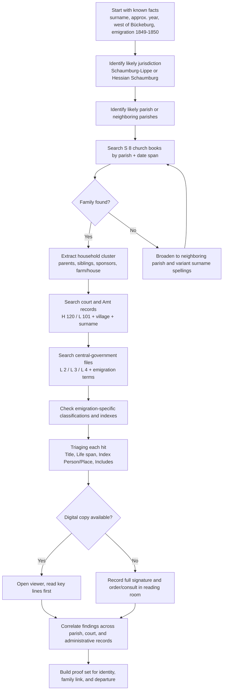

#  Genealogical Research using Bückeburg Landesarchiv and Arcinsys

## Executive summary

For ancestors who lived a few kilometers west of Bückeburg in the
eighteenth and nineteenth centuries and emigrated around 1849–1850, the
most productive research base is the **Niedersächsisches Landesarchiv,
Abteilung Bückeburg** and its **Arcinsys Niedersachsen und Bremen**
catalog. Bückeburg is the responsible NLA department for records relating
to the present-day Landkreis Schaumburg, whose territories were
historically split after 1647 and only largely recombined in 1977. That
matters because a village west of Bückeburg may fall into either
**Schaumburg-Lippe** holdings or **Hessian Schaumburg** holdings, depending
on the exact locality. If the village is unspecified, research has to
proceed by jurisdiction as well as by place-name. [^1]

The strongest genealogical sources in Bückeburg for this problem are, in
order, **evangelical church books and their surrogates**, **civil
registration holdings for later generations**, **lower-administration files
of the Ämter**, **court and probate records**, **government and chamber
files**, and **emigration-related administrative files**. Arcinsys will not
hand you a finished family tree, but it does expose the metadata,
hierarchy, signatures, indexes, and in many cases digital images that let
you identify the right records quickly. Official NLA guidance also notes
that the emigrants from the **Fürstentum Schaumburg-Lippe** have already
been comprehensively identified in a dedicated project, which is especially
promising for departures in 1849–1850. [^2]

The practical implication is straightforward. For a pre-1874 family, begin
with **parish identification and church books**; then widen into **court,
land, inheritance, tax, and chamber records** using surname, village, farm
name, occupation, and approximate dates; then check **emigration files** at
the level of Amt or central government. Arcinsys is especially useful when
the handwriting is difficult, because many Bückeburg item descriptions
carry **Index Place** and **Index Person** entries, allowing you to find
names and villages without fully reading the record itself. [^3]

The rest of this report explains how Arcinsys is structured, which
Bückeburg record groups matter most, how to search efficiently without full
transliteration, how to triage a document fast, and how to build a reliable
research sequence for an 1849–1850 emigrant family from the Bückeburg area.
[^4]

## Bückeburg archival landscape and the kinds of records that matter

The Bückeburg department preserves both **state** and
**non-state/deposited** holdings for the Schaumburg area. For genealogical
work in the eighteenth and nineteenth centuries, the most important
distinction is not “public versus private” in the modern sense, but **which
historic jurisdiction created the papers**. The relevant Bückeburg holdings
include Schaumburg-Lippe central-government files, local Amt records,
Hessian Schaumburg court records, municipal deposits, and deposited house
or chamber archives. The official NLA overview explicitly states that the
Bückeburg department is responsible for all state authorities and courts,
including their predecessors, for the Landkreis Schaumburg. [^5]

For a village a few kilometers west of Bückeburg, the first ambiguity is
territorial. If the family belonged to the **Amt Bückeburg** or **Amt
Stadthagen**, records will often appear in the **L-series** state fonds of
Schaumburg-Lippe, especially **L 101a Amt Bückeburg (mit Amt Arensburg)**
and **L 101b Amt Stadthagen (mit Amt Hagenburg)**. Both fonds contain
lower-level administrative and judicial survival with agriculture, services
and dues, registry functions, and seigneurial domain matters, which often
generate lists of inhabitants, landholders, obligations, and disputes. [^6]

If the village instead fell in the **Hessian Schaumburg** sphere, the key
records often move into the **H-series** court and fiscal holdings,
especially **H 120a Justizamt Obernkirchen** and **H 120c Justizamt /
Landgericht Rinteln**. Those fonds are genealogically rich because they
contain **Vermögensinventare**, **Eheprotokolle**,
**Vormundschaftssachen**, **Erbschaftssachen**, **Testamente**,
**Colonatssachen**, **Grundstücksverkäufe**, and related books. These are
exactly the kinds of files that reveal kinship, residences, property
succession, and pre-emigration legal cleanup. [^7]

For parish-based reconstruction, the standout Bückeburg collection is **S 8
Kirchenbücher der Ev. Gemeinden in Schaumburg**. Arcinsys describes this as
a collection of **microfiches of all church books of the
evangelical-lutheran and reformed congregations in Schaumburg**, with the
oldest books in the region beginning in the late sixteenth century. Some
entries also have digital representations visible in Arcinsys. This is the
single most important starting point for births, marriages, burials,
household reconstruction, and tracking a family backward before civil
registration. [^8]

For later generations after the creation of standesamt records, Bückeburg’s
key civil-registration fonds is **L 105 Standesämter**, described in
Arcinsys as containing **birth, marriage, and death registers of the
Schaumburg civil registry offices**, with examples such as **NLA BU L 105
Acc. 2009/006 Nr. 357** for an Achum death register and **Nr. 381** for an
Achum death-index volume with digital copies. These later records are less
central for an 1849 emigrant himself, but they are essential for
reconstructing siblings, parents who remained behind, and post-1874
descendants. [^9]

Three central-government fonds are especially valuable when the search has
to move beyond parish entries. **L 2 Alte Regierungsregistratur** covers
1553–1823 and, after 1648, initially held files for many branches of
government before specialized central authorities emerged. **L 3 Neuere
Regierungsregistratur** continues the later central administrative
recordkeeping from 1777 onward. **L 4 Schaumburg-Lippische
Landesregierung** covers the full range of the inner administration of the
state. These central fonds can contain policing, military, poor relief,
permissions, jurisdictional matters, and occasionally emigration-related or
military-service-related files that mention specific people by name. [^10]

For landholding and estate context, the deposited chamber and house
archives matter as well. **K 2 Fürstlich Schaumburg-Lippische Hofkammer:
Jüngeres Kammerarchiv** contains records of the administration of revenues
from house and chamber estates, including external properties. **F 2
Fürstliches Hausarchiv, Regierungs- und Kammerakten** is a mixed parallel
survival to state and chamber fonds and explicitly includes strong
**Militär** sections as well as chamber materials. These are not first-line
birth-marriage-death records, but they can be excellent for farm, tenancy,
estate, and military context, especially if a family was tied to domain
land or princely service. [^11]

Municipal and deposited holdings also deserve attention. **Dep. 29 Stadt
Obernkirchen** preserves the town administration of Obernkirchen and its
incorporated places; **Dep. 42 Samtgemeinde Rodenberg** preserves records
of Rodenberg and member communities; **Dep. 11 Schaumburg-Lippischer
Heimatverein, Archivaliensammlung** contains broad thematic collecting,
including the **Hokamp** genealogical collection and the cited work
*Residenz Bückeburg. Einwohner, Hausbesitzer, Straßen und Häuser
1600–1880*. These are especially useful once you have already identified
the family and want to deepen context, locate houses, or exploit compiled
local genealogical work. [^12]

## Arcinsys organization and how to navigate it efficiently

Arcinsys is the archival information system of the Niedersächsisches Landesarchiv. NLA’s current guidance describes it as the system in which users can search archival holdings, submit use applications, order material for a reading room, and view or download digitized archival material where available. NLA also states that Arcinsys Niedersachsen und Bremen provides information on more than 9 million individual archival units, with 6.6 million from the NLA divisions and large numbers of digital items online. [^13]

### Hierarchy and object types

Arcinsys formally distinguishes several hierarchical object types. The user manual states that detail pages exist for **archives**, **fonds series**, **fonds**, **item series**, **descriptions**, and **representations**. In result lists, the system shows icons for **archives**, **structure**, **fonds**, **fonds series or item series**, and **description**. For genealogists, the usual practical translation is:

- **Archive**: the repository, here often *Nds. Landesarchiv, Abt. Bückeburg*.
- **Bestand / fonds**: a record group created by one authority, court, office, or depositor, such as **L 105 Standesämter** or **H 120c Justizamt / Landgericht Rinteln**.
- **Teilbestand / sub-fonds or series**: not always labeled literally as *Teilbestand* in Arcinsys; often represented as a **structure node**, **fonds series**, or **item series**, depending on how the archive modeled the hierarchy.
- **Verzeichnungseinheit / description**: the individual archival unit, such as a register volume, file, map, or inventory.
- **Repräsentation / representation**: the physical or digital surrogate, such as original file, digital use copy, master digital copy, fiche, or film. [^14]

A good way to visualize this in Bückeburg materials is:

```text
Archive
└── Fonds
    ├── Structure / fonds-series / item-series
    │   └── Description (Verzeichnungseinheit)
    │       └── Representation(s)
```

That is exactly how Bückeburg examples behave when you click down through a fonds such as **L 105 Standesämter** to an item such as **NLA BU L 105 Acc. 2009/006 Nr. 381**, then into its individual representations. [^15]

### Core identifiers and metadata fields

Arcinsys uses an **identifier** field that functions as the archival call
number or signature. The manual explains that the identifier changes by
level: for descriptions it combines archive ID, fonds ID, and item
identifier. In practice, genealogists should copy the complete identifier
exactly as displayed. Bückeburg examples include **NLA BU H 120c C Nr.
390**, **NLA BU L 105 Acc. 2009/006 Nr. 357**, and **NLA BU S 8 Stadthagen
Nr. 1**. [^16]

The most useful metadata fields for genealogy are the ones that recur on
Bückeburg detail pages:

- **Title**: usually the best short description of the item.
- **Life span**: date span of the item; often enough to confirm the correct volume.
- **Volume**: sometimes a register or file count.
- **Former identifier**: valuable when older literature cites superseded signatures.
- **Provenance** or **Partial provenance**: who created or transferred the record.
- **Additions / Classification Part B**: sub-classification, often a place.
- **Includes**: critical content notes.
- **Index Place** and **Index Person**: extraordinarily helpful for name and place spotting without reading the whole file.
- **Information / Notes**: may reveal access conditions or whether material is provided on microfiche in the reading room. [^17]

For example, the item **NLA BU H 120c C Nr. 390** shows the title *Walbaum, Carl Wilhelm, Leibzüchter, Ahe 6 – Inventar* and the date **1823**. The item **NLA BU K 50 Nr. 126** carries both **Index Place** and **Index Person** entries, listing multiple village names and surnames. These fields are exactly what make fast genealogical triage possible. [^18]

### Search modes, fields, filters, and common workflows

Arcinsys offers **simple search**, **identifier search**, and **extended
search**. The manual states that simple search accepts one or more words;
multiple words default to **AND**; **OR** and **NOT** are supported; double
quotes search an exact phrase; and time-period fields can be used to limit
results to overlapping date ranges. The system also offers an “only objects
with digital copies” option. [^19]

The **extended search** is the most powerful genealogical mode. The
official manual screenshot and text show these core fields:

- **Search area**: selection in navigation tree, all archives, or following selection.
- **Archives identifier**
- **Fonds identifier**
- **Time period from / to**
- **Description model**
- **Description element**
- **Only objects with digital copies**  

It also explicitly notes that **fonds identifiers can be truncated with “*”
at the end** in the fonds-identifier field. [^20]

The **result list** is equally important. The manual shows a left-hand
facet tree for **hits per archives**; results can be filtered by archive or
fonds, and sorted by **identifier**, **denotation/title**, or **life
span**. In a large search, the facet tree is the fast way to isolate
Bückeburg from the broader Niedersachsen/Bremen portal. [^21]

The **details page** is where genealogical work actually happens. The
manual explains that it contains content information, functions such as
**Back**, **Show context**, and **View content**, a breadcrumb trail,
and—if linked—**Representations**. If a digital copy exists, Arcinsys shows
a **Show digital copies** button and often preview images. NLA’s current
online-use page adds that the viewer supports zooming, rotation, clipping,
and downloading/printing for personal use where the digital item is
available. [^22]

A minimal Arcinsys workflow for genealogy looks like this:

```text
Simple or extended search
→ result list with facets
→ isolate Nds. Landesarchiv, Abt. Bückeburg
→ open the fonds detail page
→ inspect hierarchy / "Show associated objects"
→ open the item detail page
→ read Title + Life span + Index Person/Place + Includes
→ if present, click "Show digital copies"
```

That workflow mirrors the manual and the Bückeburg item pages cited above. [^23]

### What the representation types usually mean

Arcinsys uses the term **representation** for the access form of an item.
In the Bückeburg records most commonly encountered by genealogists, the
representation labels include:

- **Original**: the original file, register, map, or book held by the archive.
- **Nutzungsdigitalisat**: a digital use copy for researchers.
- **Masterdigitalisat**: the master digital file created in digitization.
- **Schutzfilm / Sicherungsfilm**: protective or security film surrogates.
- **Micro-/Macrofiche**: fiche-based surrogates.
- **Papierkopie**: paper copy. [^24]

This matters because the presence of a digital use copy usually means you
can inspect the source immediately, while film or fiche may mean a
reading-room workflow or limited on-screen usability. Bückeburg’s
church-book collection **S 8** explicitly notes that the microfiches are
available immediately in the reading room without separate ordering, and
many other digitized items can be viewed online without a use application.
[^25]

## Genealogically important Bückeburg record groups

Because the exact village west of Bückeburg is unspecified, the table below
is organized by **record function** rather than a single parish or Amt.
Where useful, I have included example Bückeburg signatures to show what
Arcinsys records tend to look like.

| Record type | Why it matters genealogically | Bückeburg record groups and example signatures | Date strength for your problem | Search tips |
|---|---|---|---|---|
| **Kirchenbücher** | Best source before civil registration for baptism, marriage, burial, often witnesses and parish context | **S 8 Kirchenbücher der Ev. Gemeinden in Schaumburg**; e.g. **NLA BU S 8 Stadthagen Nr. 1**; **NLA BU S 8 Obernkirchen Abschr. Nr. 20** [^26] | Excellent for 18th–mid-19th c. | Search the parish name first, then inspect marriage and burial series before baptism-only searching if the surname is common. |
| **Personenstandsregister / Standesamtsregister** | Later-generation reconstruction, confirming siblings and parents who remained after emigration | **L 105 Standesämter**; e.g. **NLA BU L 105 Acc. 2009/006 Nr. 357**, **Nr. 381** [^9] | Mostly post-1874, but essential for collateral lines | Search both the locality and the standesamt name; use index volumes first when present. |
| **Amt records** | Lists of inhabitants, dues, disputes, service obligations, land, administrative permissions, local policing | **L 101a Amt Bückeburg**, **L 101b Amt Stadthagen**; example **NLA BU L 101b G Nr. 14b** [^27] | Very good for 18th–19th c. | Use village + surname + subject words such as Einwohner, Dienst, Abgabe, Kolon, Hof, Land. |
| **Court and probate records** | Inheritance, guardianship, inventories, marriage protocols, testaments, sales, debt, kinship | **H 120a Justizamt Obernkirchen**, **H 120c Justizamt / Landgericht Rinteln**; examples **H 120c C Nr. 390**, **G Nr. 17** [^28] | Excellent where village lay in Hessian Schaumburg | Search surname + village + Inventar, Nachlass, Vormundschaft, Eheprotokoll, Testament, Colonat. |
| **Central government files** | Permissions, military, police, poor relief, schools, roads, emigration, citizenship | **L 2 Alte Regierungsregistratur**, **L 3 Neuere Regierungsregistratur**, **L 4 Schaumburg-Lippische Landesregierung**; example **L 4 Nr. 53** with an alphabetical name index [^29] | Good, especially around 1777–1850 and later | Use broad subject searches, then facet to Bückeburg; look for indexed name lists inside content notes. |
| **Kammer- and estate-level records** | Farms, rents, dues, tenancy, domain land, princely-service context, external estates | **K 2 Jüngeres Kammerarchiv**, **F 2 Regierungs- und Kammerakten** [^11] | Good where family lived on domain/chamber land | Search village names, Hof, Gut, Meierei, Pächter, Colon, Abgabe, Dienst. |
| **Municipal deposits** | Burgess rights, house numbers, municipal poor relief, local administration, town books | **Dep. 29 Stadt Obernkirchen**, **Dep. 42 Samtgemeinde Rodenberg** [^30] | Good, especially 19th c. | Search town name plus street, Haus, Bürger, Armen, Einquartierung, Schule, Gewerbe. |
| **Emigration sources** | Departure permissions, citizenship release, debt clearance, military exemption, family chain migration | Emigration is spread across administrative files; NLA states that emigrants from **Schaumburg-Lippe are already completely recorded**; later county structure example: **Dep. 46 A > Staatsangehörigkeit, Auswanderung** [^31] | High priority for 1849–1850 | Search Auswanderung, Auswanderer, Entlassung, Staatsangehörigkeit, Konsens, Amerika, Bremen, New Orleans, and the village/Amt name. |
| **Compiled local/genealogical collections** | Shortcut into already-extracted surname, house, and family data | **Dep. 11 Schaumburg-Lippischer Heimatverein**, including Hokamp materials and literature on Bückeburg households [^32] | Supplementary but highly useful | Use after primary records identify the family; treat as guide rather than proof. |

A few Bückeburg-specific observations sharpen this table. First, **S 8** is
indispensable because it brings together the evangelical church books of
the region in a single searchable catalog context. Second, the **H 120**
court fonds are extraordinarily strong for kinship reconstruction because
they preserve probate and matrimonial-protocol material. Third, **L 2**,
**L 3**, and **L 4** are where you will often find less obvious clues such
as military obligations, poor-relief disputes, permissions, and state
correspondence surrounding departures. Finally, the **exact village
jurisdiction decides whether L-series or H-series files are primary**, so
“west of Bückeburg” is not specific enough on its own. [^33]

## Search strategy and document triage workflow

### The search strategy that works best in Arcinsys

The best Bückeburg searches rarely begin with a single person’s full name.
Arcinsys is organized by provenance, not by family, and NLA guidance
stresses the **Provenienzprinzip**: records are grouped by the bodies that
created them, not by place or topic alone. In practice, that means you
should search by **place + archival creator + date + record function**,
then use names as one discriminator among several. [^34]

A practical sequence for your problem is:

First, identify the **historic parish and jurisdiction**. If you only know
“a few kilometers west of Bückeburg,” search outward through likely
church-book and Amt contexts rather than through surname alone. Current
parish listings of the Evangelisch-Lutherische Landeskirche
Schaumburg-Lippe confirm that the territory is still divided into multiple
congregations; for historical research, that is your reminder not to assume
the parish was Bückeburg itself. [^35]

Second, search **S 8 church books** by parish name. If you get a hit like
**Obernkirchen**, open the relevant item descriptions and look for register
type, alphabetic aids, and date span. The **Obernkirchen** example in S 8
is especially useful because it includes an **alphabetical and
chronological copy of card indexes** referring back to original entries,
which is exactly the kind of shortcut that helps when you cannot yet read
every old entry fluently. [^36]

Third, after a candidate family is found in parish records, search the
relevant administrative and court fonds with a tight formula: `[surname OR
variant] + [village] + [date range] + [record-function word]` The
record-function word matters. Good German terms include **Inventar**,
**Nachlass**, **Eheprotokoll**, **Vormundschaft**, **Colonat**, **Hof**,
**Gut**, **Abgabe**, **Auswanderung**, and **Einwohner**. Bückeburg
examples show that Arcinsys often indexes people and places explicitly, so
a place-plus-surname search can surface results even before you can read
the manuscripts themselves. [^37]

Fourth, use the **extended search** rather than broad simple search when
your target is common. The manual shows that you can restrict by **archives
identifier**, **fonds identifier**, **time period**, **description model**,
and **description element**, and you can search only items with digital
copies. This is the fastest way to prevent a common surname from returning
thousands of irrelevant hits. [^20]

Fifth, search **neighboring places and neighboring standesämter/parishes**,
not just the presumed home village. NLA family-research guidance explicitly
warns that the place of registration may differ from the place of residence
and recommends checking surrounding standesamt registers as well; the same
principle is sound for parishes, courts, and emigration paperwork. For
eighteenth- and nineteenth-century rural families, baptism, marriage,
burial, probate, property sale, and emigration permission may each sit in a
slightly different geographic filing context. [^38]

Sixth, when you suspect emigration in 1849–1850, do not search only the
word **Auswanderung**. Search also for the legal or administrative
consequences of emigration: **Entlassung**, **Konsens**,
**Staatsangehörigkeit**, **Militärpflicht**, **Schulden**, **Armenwesen**,
or a destination such as **Amerika**. NLA’s emigration page explains
exactly why: emigration generated files because authorities wanted to
ensure debts were settled, dependents were not abandoned, and military
obligations were cleared. [^39]

### Variant spellings, pattern recognition, and reading shortcuts

NLA’s family-research guidance is explicit that older registers and archival records often contain variant spellings, and that family names were frequently written “by ear.” The same guidance also points out the notorious old month abbreviations such as **7ber** for **September**, not July. For this reason, do not over-trust a single exact spelling. Search and read for **patterns**, not just exact strings. [^40]

In practice, that means:

- Search **Meyer / Meier / Mejer / Maier**-style variants together.
- Expect given names in alternating order, such as **Johann Heinrich** vs. **Heinrich Johann**.
- Watch status words more than full prose: **Colonus**, **Kötter**, **Einwohner**, **Leibzüchter**, **Witwe**, **Sohn**, **Tochter**.
- Let the date and village confirm whether a hit is plausible before you reject a spelling variant. [^41]

### What to read first when you open a record

When you open an Arcinsys item page, read the **Title**, **Life span**,
**Includes**, **Index Person**, **Index Place**, and **Former identifier**
before anything else. Those six fields tell you, in under a minute, whether
the file is worth opening in full or ordering. Bückeburg examples make this
very clear: probate, inventory, and land-sale files often announce the
surname, village, occupation, and sometimes even the house number in the
title line itself. [^42]

When you open the digital image or the physical register, target the
following lines first:

- In **church books**: entry number, date, child/spouse/deceased, father, mother, witnesses/sponsors, residence.
- In **marriage records**: bride and groom, fathers, residence, occupation, sometimes age and legitimacy.
- In **death or burial records**: age, residence, spouse or parents, sometimes birthplace.
- In **inventories/probate**: deceased person, widow/widower, heirs, guardians, minor children, farm or house designation, debt and property lists.
- In **Amt or government files**: petition text, margin notes, endorsements, attached lists, and the final decision. [^43]

### Suggested mermaid flowchart



This workflow matches how Arcinsys is designed to be used and how Bückeburg fonds are structured. [^44]

## Simulated walkthroughs using hypothetical cases

The examples below are **simulated research walkthroughs**, not claims
about real persons. They are designed to show how the Bückeburg holdings
and Arcinsys metadata would be used in practice.

### Hypothetical family from an unspecified village west of Bückeburg

Suppose you are looking for **Johann Heinrich Meier**, born about **1821**,
said to have lived west of Bückeburg and emigrated in **1849**. Because the
village is unspecified, do not start with `"Johann Heinrich Meier"` in all
of Arcinsys. Start instead with likely west-of-Bückeburg parish candidates
in **S 8**. If **Obernkirchen** is a plausible parish, search for
`Obernkirchen` inside Bückeburg or browse **S 8**. A likely hit pattern is
something like **NLA BU S 8 Obernkirchen Abschr. Nr. 20 – Heiratsregister
Obernkirchen A-L, 1620–1699**, which demonstrates that parish-specific
index aids exist, or an actual register volume like the **Stadthagen**
example, which combines a parish title, a date span, and digital or fiche
representations. [^45]

If the surname is common, the next move is to reconstruct a **household
cluster** rather than isolate the emigrant immediately. From the church
books, extract parents, siblings, and any farm or house designations. Then
pivot to court material in the likely jurisdiction. If the village belonged
to Hessian Schaumburg, search **H 120a** or **H 120c** with the surname and
place. A result might resemble **NLA BU H 120c C Nr. 390 – Walbaum, Carl
Wilhelm, Leibzüchter, Ahe 6 – Inventar**: title first, occupation second,
house designation third. That structure tells you exactly what to scan for
in your own search results. [^46]

After that, search for emigration-related administrative context. Because
NLA states that emigrants from **Schaumburg-Lippe** have been
comprehensively recorded, search with `Meier Obernkirchen Auswanderung`,
then broaden to `Meier Amerika`, `Meier Entlassung`, `Meier
Staatsangehörigkeit`, and the village name alone within Bückeburg fonds.
Even if the direct hit is absent, the right framework is still confirmed by
the NLA emigration guidance: emigration files were created when authorities
reviewed debts, dependents, and military obligations. [^39]

### Hypothetical woman whose brothers emigrated in 1850

Now suppose your known person is **Anna Catharina Grote**, married in
**1848**, with brothers said to have left for America in **1850**. Start
with the marriage entry in the parish register, because marriage records
often identify fathers and residences more clearly than baptismal entries.
Then search court/probate records for the father’s household. In
Hessen-Schaumburg contexts, **Eheprotokolle**, **Vormundschaftssachen**,
**Nachlässe**, and **Inventare** are exactly the documentary types
preserved in **H 120a** and **H 120c**. If Anna’s father died before or
shortly after the brothers emigrated, a probate file may list all heirs,
including those “in Amerika” or absent from the locality. [^7]

If the family held or leased land, move next into local-administration
files. **L 101a** and **L 101b** preserve material on agriculture, dues,
registry matters, and lordly domain management. That type of record is
especially useful if the emigration was tied to sale, transfer, or
surrender of a holding. A modern example of the kind of local-detailing
metadata Arcinsys exposes is **NLA BU K 50 Nr. 126**, where multiple
colonists and villages are indexed individually by **Index Place** and
**Index Person**. Your target file may not be in K 50, but the principle is
the same: place-plus-surname-plus status term produces much better results
than bare-name searching. [^47]

### Hypothetical late follow-up through civil registration

Finally, suppose the emigrant’s parents remained behind and died after the
advent of civil registration. In that case, once you know the likely home
locality, move into **L 105 Standesämter**. Arcinsys examples show that
some standesamt volumes are indexed through separate
**Inhaltsverzeichnisse** and that some of those index volumes are
digitized. A hit like **NLA BU L 105 Acc. 2009/006 Nr. 381 –
Inhaltsverzeichnis zum Sterberegister des Standesamts Achum, 1894–1973** is
exactly the kind of item that lets you jump to a death entry quickly, even
if you do not yet know the exact death year. [^48]

In all three simulations, the method is the same: use Arcinsys metadata to
locate the **right function of recordkeeping**, not just the “right name.”
That is how you save time in Bückeburg. [^49]

## Pitfalls, limitations, and the best supporting sources to consult next

The biggest pitfall is assuming that “west of Bückeburg” points to one tidy
archival path. It does not. The archival jurisdiction may be
**Schaumburg-Lippe**, **Hessian Schaumburg**, or a municipal/deposit
context, and the parish boundary may not match the civil boundary.
Bückeburg’s own church-book notice explicitly warns that **political and
ecclesiastical boundaries do not always coincide**. [^50]

A second pitfall is assuming that full-text name search is enough. Arcinsys
is powerful, but it is not a complete OCR or handwriting-recognition tool
for all records. NLA’s family-research guide emphasizes that archival
research remains detective work and that not all sources are digitized or
fully indexed. Arcinsys helps you locate the right
**Verzeichnungseinheit**; it does not eliminate the need to read the source
or correlate multiple records. [^51]

A third pitfall is overlooking access and coverage limits. NLA’s FAQ states
that records under protection periods or other access restrictions
generally cannot be freely searched in Arcinsys; some can only be found on
special request or in the reading rooms. In the Bückeburg house/chamber
archives, Arcinsys also notes separate owner-permission requirements for
younger portions of some deposited holdings, although that is usually less
relevant for eighteenth- and nineteenth-century genealogy. [^52]

A fourth pitfall is failing to exploit **secondary but targeted finding
aids**. Bückeburg’s own publication list includes especially useful works
such as **Die Eheberedungen des Amtes Stadthagen** and older archive
inventories. These are not substitutes for the original records, but they
can save enormous time by pointing you to the right files and by
identifying recurring surname/place contexts. [^53]

The most useful supporting sources, prioritized from primary/official to
secondary, are these:

**First priority: primary and official**
  
Arcinsys itself, starting with **S 8**, **L 105**, **L 101a/L 101b**, **H
120a/H 120c**, **L 2/L 3/L 4**, and relevant municipal deposits. NLA’s
online-use guidance confirms that digitized items can be viewed in Arcinsys
and downloaded for personal use where available. [^54]

NLA’s official page **Quellen zur Auswanderung im Niedersächsischen
Landesarchiv**, because it directly explains which administrative layers
created emigration files and states that the emigrants from
Schaumburg-Lippe have already been completely recorded. For your 1849–1850
emigrants, this should be near the top of the checklist. [^39]

The official parish context of the **Evangelisch-Lutherische Landeskirche
Schaumburg-Lippe**, because parish identification is the most important
first step when the village is unspecified. The landeskirche’s parish
overview is a starting point for mapping likely ecclesiastical
jurisdictions before diving into church-book surrogates in S 8. [^55]

**Second priority: official discovery portals that extend one search outward**
  
NLA’s own online-use page points researchers outward to **Archivportal-D**,
the **Deutsche Digitale Bibliothek**, and **Kulturerbe Niedersachsen** for
broader discovery of freely accessible metadata and digital content. These
are especially useful if a person, related locality, or parallel holding
appears outside Bückeburg itself. [^56]

**Third priority: specialized emigration and local-history aids**
  
The **Deutsche Auswanderer-Datenbank** is a major external discovery aid
for emigrants from German territories in the 1840–1938 period. It is not a
substitute for Bückeburg’s emigration files, but it is a logical
cross-check once you have a likely emigrant identity. [^57]

The **Schaumburg-Lippischer Heimatverein / Hokamp** materials and local
publications such as **Residenz Bückeburg. Einwohner, Hausbesitzer, Straßen
und Häuser 1600–1880** can be extremely effective in confirming houses,
family clusters, and local context after the archival base is established.
[^32]

## Glossary of German archival and genealogical terms

The glossary below is tuned to what you will actually encounter in
Bückeburg’s Arcinsys environment and adjacent German genealogical practice.
Definitions are in plain English, and the examples are chosen from official
NLA guidance or Bückeburg Arcinsys records. [^58]

| German term or abbreviation | English meaning | What it usually means in research practice | Example relevant to Bückeburg |
|---|---|---|---|
| **Archiv** | archive / repository | The institution holding records | *Nds. Landesarchiv, Abt. Bückeburg* [^5] |
| **Bestand** | fonds / record group | Records of one creator, office, court, or depositor | **L 105 Standesämter** [^59] |
| **Teilbestand** | sub-fonds / subordinate grouping | Often represented in Arcinsys as structure, fonds series, or item series rather than with one fixed label | Arcinsys manual object hierarchy [^60] |
| **Findbuch** | finding aid / inventory | Inventory used to locate items within a fonds | Many Bückeburg fonds state “Erschließung: Findbuch” [^61] |
| **Signatur** | call number / archival signature | The precise archival identifier you cite and order | **NLA BU H 120c C Nr. 390** [^62] |
| **Verzeichnungseinheit** | described archival unit | The individual file, register, volume, map, etc. | Arcinsys “Description: Item description” [^63] |
| **Repräsentation** | representation | The access form: original, digital copy, fiche, film | Original / Nutzungsdigitalisat / Masterdigitalisat [^64] |
| **Kirchenbuch** | parish register / church book | Register of baptisms, marriages, deaths, often confirmations | **S 8 Kirchenbücher der Ev. Gemeinden in Schaumburg** [^65] |
| **Taufregister / Getaufte** | baptism register | Baptisms or christenings | *Verzeichnis der Getauften …* in S 8 example [^66] |
| **Heiratsregister / Getraute** | marriage register | Marriages or church weddings | *Heiratsregister Obernkirchen A-L* [^36] |
| **Sterberegister / Gestorbene** | death register / burials | Deaths or burials | *Sterberegister des Standesamts Achum* [^67] |
| **Personenstandsregister** | civil-status register | Birth, marriage, and death registers kept by state civil registrars | NLA explains standesamt registration after 1874/1875 [^68] |
| **Standesamt** | civil registry office | Office that records births, marriages, deaths | **L 105 Standesämter** [^59] |
| **Zivilstandsregister** | civil-status register | Earlier civil registration, often in Napoleonic or Westphalian contexts | Defined in NLA family guide [^69] |
| **Kirchennebenbuch** | duplicate church register | Second copy sent to an authority; often what survives in archives | NLA explains main and duplicate church books in 19th c. practice [^70] |
| **Einwohner** | inhabitant / resident | Often a status descriptor in file titles or index fields | *Hilken, Einwohner zu Uchtdorf* [^71] |
| **Einwohnerliste** | inhabitants list | List of residents, sometimes for tax, service, or civic administration | May appear inside Amt, municipal, or government files rather than as its own fonds; search for Einwohner + village [^6] |
| **Steuerliste / Schatzregister** | tax list / tax roll | Fiscal list of taxpayers or assessed households | Useful substitute when parish records are weak; NLA’s family guide explicitly points to tax registers as replacement evidence when church books fail [^40] |
| **Militärakten / Militaria** | military records | Service, obligations, awards, conscription, related administration | **L 2 M** subject-letter logic; strong military section also in **F 2**; indexed-name example in **L 4 Nr. 53** [^72] |
| **Auswanderung / Auswanderer** | emigration / emigrant | Administrative records about leaving the territory | NLA emigration guidance; **Dep. 46 A > Staatsangehörigkeit, Auswanderung** as a classification example [^31] |
| **Hof- und Güterverzeichnisse** | farm and estate registers | Lists of holdings, tenants, obligations, or estate structure | Often encountered via chamber, estate, and municipal holdings such as **K 2**, estate/meierei records, or Hokamp materials [^73] |
| **Colonat / Colon** | hereditary tenant holding / colonist-tenant | Common rural tenure status in legal and estate files | **Colonatssachen** listed in **H 120c**; “Colonen” appear in item titles like **K 50 Nr. 126** [^74] |
| **Leibzüchter** | retired farmer on maintenance | Elderly former holder living on the farm under retirement provision | *Walbaum, Carl Wilhelm, Leibzüchter, Ahe 6* [^62] |
| **Vormundschaft** | guardianship | File about minors, guardians, inheritance management | Explicitly listed in **H 120a/H 120c** [^7] |
| **Nachlass / Nachlassenschaft** | estate / probate | The deceased’s estate, distribution, and heirs | *Nachlassenschaft des … Joh. Arend Menke* [^75] |
| **Inventar / Vermögensinventar** | inventory / estate inventory | Detailed list of property and debts, often naming heirs and relatives | Explicit in **H 120a/H 120c** and in item **H 120c C Nr. 390** [^46] |
| **Eheprotokoll / Eheberedung** | marriage protocol / marriage negotiation | Pre-marital legal or economic agreement, often rich in kinship detail | Explicit in **H 120a/H 120c**; Bückeburg publication **Die Eheberedungen des Amtes Stadthagen** [^76] |
| **Konsens** | official permission/consent | Frequently the permission needed for a legal act such as marriage or emigration | Implied by NLA’s explanation of how emigration generated files requiring authority consent [^39] |
| **Acc.** | accession | Later transfer batch number within a fonds | **L 105 Acc. 2009/006 Nr. 381** [^77] |
| **Nr.** | number | Item number within a fonds or accession | Common in almost every Bückeburg signature [^78] |
| **masch.** | typewritten | Typewritten finding aid or description | e.g. “Findbuch, masch.” in K 2 [^79] |
| **EDV** | electronic data processing | Computerized finding aid / electronically indexed | Common in Bückeburg fonds descriptions [^61] |
| **7ber / 8ber / 9ber / Xber** | archaic month abbreviations | September / October / November / December | NLA family guide explicitly warns about these older abbreviations [^40] |

One final interpretive rule is worth stressing. In Bückeburg records, a term like **Einwohner**, **Colonus**, **Leibzüchter**, **Witwe**, or a farm/village designation is often more diagnostically useful than the full sentence around it. In difficult handwriting, train your eye to harvest those status words first. [^37]

[^1]: <https://nla.niedersachsen.de/download/175466>
[^2]: <https://www.arcinsys.niedersachsen.de/arcinsys/detailAction.action?detailid=b821>
[^3]: <https://www.arcinsys.niedersachsen.de/arcinsys/detailAction.action?detailid=v10913067>
[^4]: <https://nla.niedersachsen.de/startseite/benutzung/online_recherche_arcinsys/recherche-und-nutzung-mit-arcinsys-127905.html>
[^5]: <https://nla.niedersachsen.de/download/175466>
[^6]: <https://www.arcinsys.niedersachsen.de/arcinsys/detailAction.action?detailid=b526>
[^7]: <https://www.arcinsys.niedersachsen.de/arcinsys/detailAction.action?detailid=b587>
[^8]: <https://www.arcinsys.niedersachsen.de/arcinsys/detailAction.action?detailid=b821>
[^9]: <https://www.arcinsys.niedersachsen.de/arcinsys/detailAction.action?detailid=b751>
[^10]: <https://www.arcinsys.niedersachsen.de/arcinsys/detailAction.action?detailid=b659>
[^11]: <https://www.arcinsys.niedersachsen.de/arcinsys/detailAction.action?detailid=b696>
[^12]: <https://www.arcinsys.niedersachsen.de/arcinsys/detailAction.action?detailid=b730>
[^13]: <https://nla.niedersachsen.de/startseite/benutzung/faq/suchen-finden-nutzen-197387.html>
[^14]: <https://www.arcinsys.de/help/arcinsysmanual_v2024.2.1.pdf>
[^15]: <https://www.arcinsys.niedersachsen.de/arcinsys/detailAction.action?detailid=b751>
[^16]: <https://www.arcinsys.de/help/arcinsysmanual_v2024.2.1.pdf>
[^17]: <https://www.arcinsys.niedersachsen.de/arcinsys/detailAction.action?detailid=v3732078>
[^18]: <https://www.arcinsys.niedersachsen.de/arcinsys/detailAction.action?detailid=v4971080>
[^19]: <https://www.arcinsys.de/help/arcinsysmanual_v2024.2.1.pdf>
[^20]: <https://www.arcinsys.de/help/arcinsysmanual_v2024.2.1.pdf>
[^21]: <https://www.arcinsys.de/help/arcinsysmanual_v2024.2.1.pdf>
[^22]: <https://www.arcinsys.de/help/arcinsysmanual_v2024.2.1.pdf>
[^23]: <https://www.arcinsys.de/help/arcinsysmanual_v2024.2.1.pdf>
[^24]: <https://www.arcinsys.de/help/arcinsysmanual_v2024.2.1.pdf>
[^25]: <https://www.arcinsys.niedersachsen.de/arcinsys/detailAction.action?detailid=b821>
[^26]: <https://www.arcinsys.niedersachsen.de/arcinsys/detailAction.action?detailid=b821>
[^27]: <https://www.arcinsys.niedersachsen.de/arcinsys/detailAction.action?detailid=b526>
[^28]: <https://www.arcinsys.niedersachsen.de/arcinsys/detailAction.action?detailid=b587>
[^29]: <https://www.arcinsys.niedersachsen.de/arcinsys/detailAction.action?detailid=b659>
[^30]: <https://www.arcinsys.niedersachsen.de/arcinsys/detailAction.action?detailid=b730>
[^31]: <https://nla.niedersachsen.de/startseite/benutzung/nutzliche_hilfsmittel/quellen-zur-auswanderung-im-niedersaechsischen-landesarchiv-85731.html>
[^32]: <https://www.arcinsys.niedersachsen.de/arcinsys/detailAction.action?detailid=b807>
[^33]: <https://www.arcinsys.niedersachsen.de/arcinsys/detailAction.action?detailid=b821>
[^34]: <https://nla.niedersachsen.de/download/101353/NLA_OS_Leitfaden_Familienforschung.pdf>
[^35]: <https://www.landeskirche-schaumburg-lippe.de/kirche-und-leben/kirchengemeinden>
[^36]: <https://www.arcinsys.niedersachsen.de/arcinsys/detailAction.action?detailid=v10913067>
[^37]: <https://www.arcinsys.niedersachsen.de/arcinsys/detailAction.action?detailid=v4971341>
[^38]: <https://nla.niedersachsen.de/download/101353/NLA_OS_Leitfaden_Familienforschung.pdf>
[^39]: <https://nla.niedersachsen.de/startseite/benutzung/nutzliche_hilfsmittel/quellen-zur-auswanderung-im-niedersaechsischen-landesarchiv-85731.html>
[^40]: <https://nla.niedersachsen.de/startseite/benutzung/nutzliche_hilfsmittel/-85855.html>
[^41]: <https://nla.niedersachsen.de/startseite/benutzung/nutzliche_hilfsmittel/-85855.html>
[^42]: <https://www.arcinsys.niedersachsen.de/arcinsys/detailAction.action?detailid=v4971080>
[^43]: <https://www.arcinsys.niedersachsen.de/arcinsys/detailAction.action?detailid=v5014861>
[^44]: <https://www.arcinsys.de/help/arcinsysmanual_v2024.2.1.pdf>
[^45]: <https://www.arcinsys.niedersachsen.de/arcinsys/detailAction.action?detailid=v10913067>
[^46]: <https://www.arcinsys.niedersachsen.de/arcinsys/detailAction.action?detailid=b587>
[^47]: <https://www.arcinsys.niedersachsen.de/arcinsys/detailAction.action?detailid=b526>
[^48]: <https://www.arcinsys.niedersachsen.de/arcinsys/detailAction.action?detailid=b751>
[^49]: <https://nla.niedersachsen.de/download/101353/NLA_OS_Leitfaden_Familienforschung.pdf>
[^50]: <https://www.arcinsys.niedersachsen.de/arcinsys/detailAction.action?detailid=b821>
[^51]: <https://nla.niedersachsen.de/download/101353/NLA_OS_Leitfaden_Familienforschung.pdf>
[^52]: <https://nla.niedersachsen.de/startseite/benutzung/faq/suchen-finden-nutzen-197387.html>
[^53]: <https://nla.niedersachsen.de/startseite/landesgeschichte/veroffentlichungen/altere_veroffentlichungen/das_niedersachsische_landesarchiv_und_seine_bestande/inventare_und_kleinere_schriften_der_staatsarchive/staatsarchiv_buckeburg/-85889.html>
[^54]: <https://www.arcinsys.niedersachsen.de/arcinsys/detailAction.action?detailid=b821>
[^55]: <https://www.landeskirche-schaumburg-lippe.de/kirche-und-leben/kirchengemeinden>
[^56]: <https://nla.niedersachsen.de/startseite/benutzung/online_nutzung/archivalien-online-nutzen-197441.html>
[^57]: <https://www.deutsche-auswanderer-datenbank.de/>
[^58]: <https://nla.niedersachsen.de/download/101353/NLA_OS_Leitfaden_Familienforschung.pdf>
[^59]: <https://www.arcinsys.niedersachsen.de/arcinsys/detailAction.action?detailid=b751>
[^60]: <https://www.arcinsys.de/help/arcinsysmanual_v2024.2.1.pdf>
[^61]: <https://www.arcinsys.niedersachsen.de/arcinsys/detailAction.action?detailid=b526>
[^62]: <https://www.arcinsys.niedersachsen.de/arcinsys/detailAction.action?detailid=v4971080>
[^63]: <https://www.arcinsys.de/help/arcinsysmanual_v2024.2.1.pdf>
[^64]: <https://www.arcinsys.niedersachsen.de/arcinsys/detailAction.action?detailid=v3732078>
[^65]: <https://www.arcinsys.niedersachsen.de/arcinsys/detailAction.action?detailid=b821>
[^66]: <https://www.arcinsys.niedersachsen.de/arcinsys/detailAction.action?detailid=v5014861>
[^67]: <https://www.arcinsys.niedersachsen.de/arcinsys/detailAction.action?detailid=v3731318>
[^68]: <https://nla.niedersachsen.de/download/101353/NLA_OS_Leitfaden_Familienforschung.pdf>
[^69]: <https://nla.niedersachsen.de/download/101353/NLA_OS_Leitfaden_Familienforschung.pdf>
[^70]: <https://nla.niedersachsen.de/download/101353/NLA_OS_Leitfaden_Familienforschung.pdf>
[^71]: <https://www.arcinsys.niedersachsen.de/arcinsys/detailAction.action?detailid=v4971341>
[^72]: <https://www.arcinsys.niedersachsen.de/arcinsys/detailAction.action?detailid=b659>
[^73]: <https://www.arcinsys.niedersachsen.de/arcinsys/detailAction.action?detailid=b696>
[^74]: <https://www.arcinsys.niedersachsen.de/arcinsys/detailAction.action?detailid=b589>
[^75]: <https://www.arcinsys.niedersachsen.de/arcinsys/detailAction.action?detailid=v4971686>
[^76]: <https://www.arcinsys.niedersachsen.de/arcinsys/detailAction.action?detailid=b587>
[^77]: <https://www.arcinsys.niedersachsen.de/arcinsys/detailAction.action?detailid=v3732078>
[^78]: <https://www.arcinsys.niedersachsen.de/arcinsys/detailAction.action?detailid=v4971080>
[^79]: <https://www.arcinsys.niedersachsen.de/arcinsys/detailAction.action?detailid=b696>
